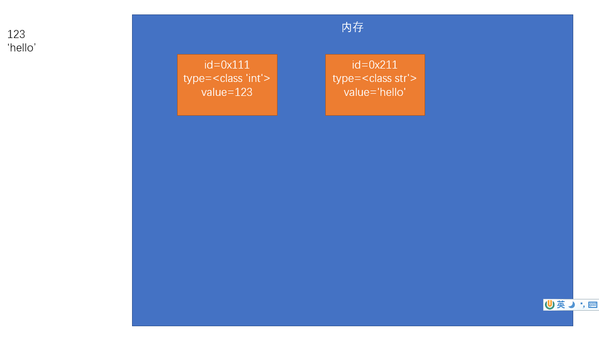
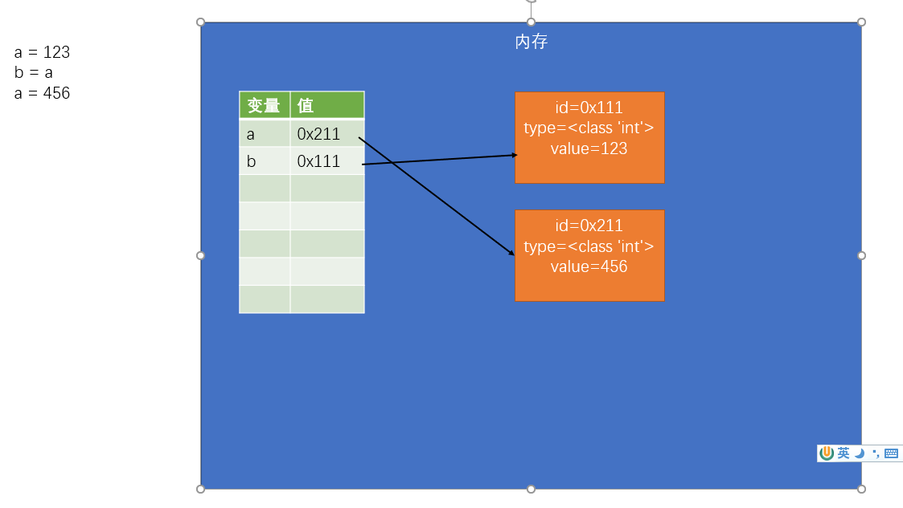

# Python Basic

## 标识符

在Python中所有可以自主命名的内容都属于标识符
比如：变量名、函数名、类名。标识符必须遵循标识符的规范

  1. 标识符中可以含有字母、数字、_，但是不能使用数字开头
      例子：a_1 _a1 _1a
  2. 标识符不能是Python中的关键字和保留字
      也不建议使用Python中的函数名作为标识符,因为这样会导致函数被覆盖
  3. 命名规范：
      在Python中注意遵循两种命名规范：

    下划线命名法
    所有字母小写，单词之间使用_分割
        max_length 
        min_length 
        hello_world 
        xxx_yyy_zzz

    帕斯卡命名法（大驼峰命名法）  
    首字母大写，每个单词开头字母大写，其余字母小写
        MaxLength 
        MinLength 
        HelloWorld 
        XxxYyyZzz  

---

## 数据类型   

数值

- Python中的整数的大小没有限制，可以是一个无限大的整数

    `c = 999999999999999999999999999999999999999999999 ** 100`

- 如果数字的长度过大，可以使用下划线作为分隔符

    `c = 123_456_789`

- 10进制的数字不能以0开头

    其他进制的整数，只要是数字打印时一定是以十进制的形式显示的
    - ~~d = 0123~~
    - 二进制 0b开头

        `c = 0b10 # 二进制的10`
    - 八进制 0o开头

        `c = 0o10`
    - 十六进制 0x开头

        `c = 0x10`

- 可以通过运算符来对数字进行运算，并且可以保证整数运算的精确

    `c = -100`

    `c = c + 3`

- 浮点数（小数），在Python中所有的小数都是float类型

    `c = 1.23`

- 在对浮点数做算术运算时，结果也会返回一个浮点数

    `c = 25.0`

    `c = c // 5 ## c = 5.0`

- 对浮点数进行运算时，可能会得到一个不精确的结果

    `c = 0.1 + 0.2`

    `print(c) ## 0.30000000000000004`

布尔值

- 布尔值主要用来做逻辑判断，一共有两个: True 和 False

- 布尔值实际上也属于整型，True就相当于1，False就相当于0

    `print(1 + False)` ## output: 1

空值
- `None` 专门用来表示不存在

    `b = None`

字符串

-  字符串必须使用引号引起来。引号可以是双引号，也可以是单引号，但是注意不要混着用

    ~~s = abc~~ `abc` 被认为是变量  

-  引号不能混合使用

    ~~s = 'hello"~~

    SyntaxError: EOL while scanning string literal

- 相同的引号之间不能嵌套

    s = `"AI says "`Hello World!`""`

    不同的引号间可以嵌套

    s = `'AI says "Hello World!"'`

- 使用三重引号来表示一个长字符串 `''' """`

    三重引号可以换行，并且会保留字符串中的格式（带换行符）

    s = `'''Hello world!`

    `Hello world again!'''`

- 如果将字符串和数字相乘，则解释器会将字符串重复指定的次数并返回

    `s = s * 20`

- 转义字符

    可以使用 \ 作为转义字符，通过转义字符，可以在字符串中使用一些特殊的内容

    - `\'` 表示 '
    - `\"` 表示 "
    - `\t` 表示制表符
    - `\n` 表示换行符
    - `\\` 表示反斜杠
    - `\uxxxx` 表示Unicode编码

    s = `"AI says:\"Hello，\nWorld\""`

    s = `'\u2250'`

    print(s)

格式化字符串

- 字符串之间可以进行加法运算

    如果将两个字符串进行相加，则会自动将两个字符串拼接为一个
    ```
    a = 'abc' + 'haha'
    print("a = " + a) # 在Python中不常见
    ```

- 字符串不能和其他的类型进行加法运算
    ```    
    a = 123
    print('a =',a) # 这种写法更好
    ```

- 在创建字符串时，可以在字符串中指定占位符
    - `%s` 在字符串中表示任意字符
    - `%f` 浮点数占位符
    - `%d` 整数占位符,直接舍弃小数位
    - `%n1.n2s` 字符串的长度限制在n1-n2之间，多了截取，少了前补空格
    - `%.nf` 浮点数保留n位小数，四舍五入
    
    ```
    b = 'Hello %s'%'Alice'

    b = 'Hello %s and %s'%('Alice','Bob')

    b = 'Hello %3.5s'%'abcdefg' # abcde

    b = 'Hello %s'%123.456 # 123.456

    b = 'Hello %.2f'%123.456 # 123.46

    b = 'Hello %d'%123.95 # 123
    ```

- 可以通过在字符串前添加一个f来创建一个格式化字符串

    在格式化字符串中可以直接嵌入变量

    ```
    c = f'hello {a} {b}'
    print(f'a = {a}')
    ```

类型检查

- 通过类型检查，可以检查值（变量）的类型

- 该函数会将检查结果作为返回值返回
    ```
    print(type(1)) # <class 'int'>
    print(type(1.5)) # <class 'float'>
    print(type(True)) # <class 'bool'>
    print(type('hello'))  # <class 'str'>
    print(type(None)) # <class 'NoneType'>
    ```

---

## 对象

对象的结构

- 标识（id）
    - id 用来标识对象的唯一性，由解析器生成，在CPython中，ip就是对象的内存地址
    - 通过 `id()`查看对象的 id
    - 对象一旦创建，则它的 id **不会再改变**

- 类型（type）
    - type 用来标识对象所属的类型，如 int，str，float，bool 等，type 决定了对象的功能
    - 通过 `type()` 查看对象类型
    - Python 为强类型语言，对象一旦创建，则**类型不能改变**

- 值（value）
    - value 为对象中存储的具体数值，某些对象值是可以改变的
    - 分为**可变对象**和**不可变对象**

    ---
    
    ---

变量和对象

- 对象并没有直接存储到变量中，在Python中变量更像是给对象起了一个别名

- 变量中存储的不是对象的值，而是对象的 `id`（内存地址），当我们使用变量时，实际上就是在通过对象 id 在查找对象

- 变量中保存的对象，只有在为变量重新赋值时才会改变

- 变量和变量之间是相互独立的，修改一个变量不会影响另一个变量

    

类型转换

- 将一个类型的对象转换为其他对象
- 类型转换不是改变对象本身的类型，而是根据当前对象的值创建一个新对象，并作为返回值返回，**不会对原来的变量产生影响**

- `int()` 可以用来将其他的对象转换为整型，

    - 布尔值：True -> 1   False -> 0
    - 浮点数：直接取整，省略小数点后的内容
    - 字符串：合法的整数字符串，直接转换为对应的数字，如果不是一个合法的整数字符串，则报错  `ValueError: invalid literal for int() with base 10: '11.5'`
    - 对于其他不可转换为整型的对象，直接抛出异常 ValueError

- `float()` 和 `int()` 基本一致，不同的是它会将对象转换为浮点数

- `str()` 可以将对象转换为字符串

    `True -> 'True'`

    `False -> 'False'`

    `123 -> '123'`

- `bool()` 可以将对象转换为布尔值，任何对象都可以转换为布尔值
    - 对于所有表示空性的对象都会转换为False，其余的转换为True
    - 表示的空性对象：`0` 、 `None` 、 `''` 等

---

## 运算符

算数运算符
- `+` 加法运算符（如果是两个字符串之间进行加法运算，则会进行拼串操作）
- `-` 减法运算符
- `*` 乘法运算符（如果将字符串和数字相乘，则会对字符串进行复制操作，将字符串重复指定次数）
- `/` 除法运算符，运算时结果总会返回一个**浮点类型**
- `//` 整除，只会保留计算后的整数位，总会返回一个整型（对浮点数做运算时除外）
- `**` 幂运算，求一个值的几次幂
- `%` 取模，求两个数相除的余数

赋值运算符

- `+=`, `-=`, `*=` 等可以将等号右侧的值赋值给等号左侧的变量

关系运算符

- `>`, `<`, `>=`, `<=` 比较值的大小
- `==`, `!=` 比较对象的**值**是否相等，而不是 id
- `is`, `is not` 比较两个对象是否为同一个**对象**，比较的是对象的 `id`
    ```
    result = 1 == True # True
    result = 1 is True # False
    ```
- 在Python中可以对两个字符串进行大于（等于）或小于（等于）的运算，
    - 当对字符串进行比较时，实际上比较的是字符串的Unicode编码
    - 比较两个字符串的Unicode编码时，是逐位比较的
    - 利用该特性可以对字符串按照字母顺序进行排序，但是对中文意义不大
    - 注意：如果不希望比较两个字符串的Unicode编码，则需要将其转换为数字然后再比较

    ```
    result = 'a' > 'b' # False
    result = 'hello' == 'hello' # True
    result = 'abc' == 'bcd' # False

    result = '2' > '11' # True
    result = int('2') > int('11') # False
    ```

逻辑运算符
- `not` 可以对符号右侧的值进行非运算
    - 对于布尔值，非运算会对其进行取反操作，True变False，False变True
    - 对于非布尔值，非运算会先将其转换为布尔值，然后再取反
    ```
    a = 1
    a = not a # False
    ```

- `and` 可以对符号两侧的值进行与运算
    - 与运算是找 `False` 的，如果第一个值是False，则直接返回第一个值，否则返回第二个值

- `or` 可以对符号两侧的值进行或运算
    - 或运算是找 `True` 的，如果第一个值是True，则直接返回第一个值，否则返回第二个值  

- 当我们对非布尔值进行与或运算时，Python会将其当做布尔值运算，最终会返回原值，运算规则同上（直接返回第一个值或第二个值）
    ```
    # True or True
    result = 1 or 2 # 1
    # True or False
    result = 1 or 0 # 1
    # False or True
    result = 0 or 1 # 1
    # False or False
    result = 0 or None # None
    ```

条件运算符
- 语法： 语句1 `if` 条件表达式 `else` 语句2
- 先对条件表达式进行求值判断
    - 如果判断结果为 `True`，则执行语句1，并返回执行结果
    - 如果判断结果为 `False`，则执行语句2，并返回执行结果

    ```
    # 获取a和b之间的较大值
    max = a if a > b else b
    ```

逻辑运算符（仅补充）
- 在表格中位置越靠下的运算符优先级越高，优先级越高的越优先计算，如果优先级一样则自左向右计算
- `and` 的优先级比 `or` 高
    ```
    a = 1 or 2 and 3 # 先计算与运算，即 1 or (2 and 3)，结果为 1
- 逻辑运算符可以连着使用
    ```
    result = 1 < 2 < 3 # 相当于 1 < 2 and 2 < 3
    result = 10 < 20 > 15 # 相当于 10 < 20 and 20 > 15，结果为 True 
    ```

---

## 流程控制

循环相关
- `break` 可以用来立即退出循环语句（包括else）
- `continue` 可以用来跳过当次循环
- `break` 和 `continue` 都是只对离他最近的循环起作用
- `pass` 是用来在判断或循环语句中占位的

```
i = 0
if i < 5:
    pass
```

程序优化
- 引入一个 time 模块，来统计程序执行的时间
- `time()` 函数可以用来获取当前的时间，返回的单位是秒

```
from time import *

begin = time()

i = 2
while i <= 100000:
    flag = True
    j = 2 
    while j <= i ** 0.5:
        if i % j == 0:
            flag = False
            # 一旦进入判断，则证明i一定不是质数，此时内层循环没有继续执行的必要
            # 使用break来退出内层的循环
            break
        j += 1
    if flag :
        # print(i)  
        pass
    i += 1

# 获取程序结束的时间
end = time()

# 计算程序执行的时间
print("程序执行花费了：",end - begin , "秒")
```