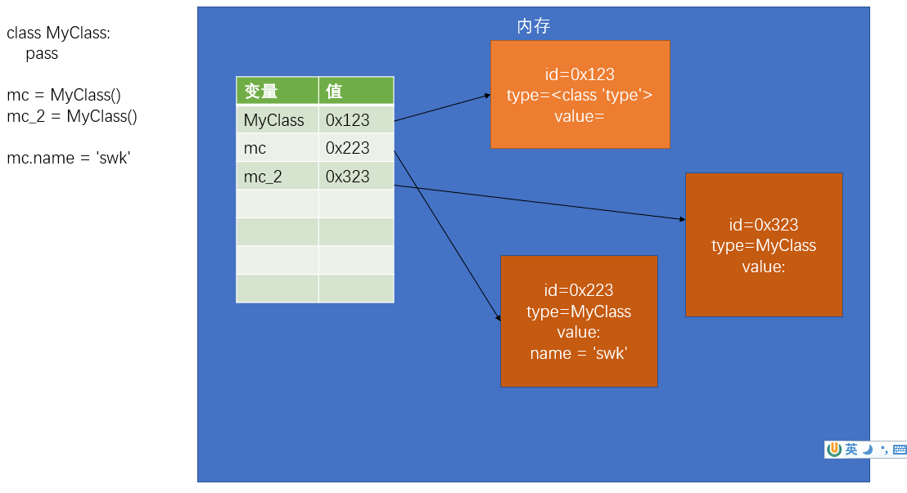
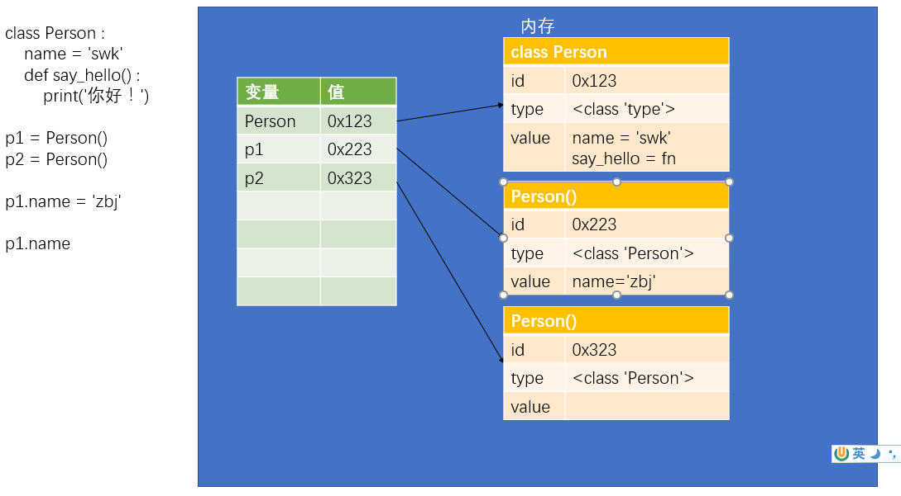

# Python Object

## 类（`class`）

- 对象是类的实例（instance）
    - 类也是一个对象
    - 即一个用来创建对象的对象
    - 类是 `type` 类型的对象，定义类实际上就是定义了一个type类型的对象

- 如果多个对象通过一个类创建，我们称这些对象是一类对象

    `a = int(10) # 创建一个int类的实例 等价于 a = 10`

- 自定义的类可以使用大写字母开头，并使用大驼峰命名法（帕斯卡命名法）来对类命名

    ```
    # 定义一个简单的类
    # 使用class关键字来定义类
    # class 类名([父类]):
    #   代码块
    # <class '__main__.MyClass'>
    class MyClass():
        pass
    
    # 使用类来创建对象
    mc = MyClass() # mc就是通过MyClass创建的对象，mc是MyClass的实例
    ```

- 创建对象流程
    - 创建一个变量
    - 在内存中创建一个新对象（公共属性和方法在此处生成并运行）
    - 执行 `__init__(self)` 方法
    - 将对象的id赋值给变量

    

- 可以向对象中添加变量，对象中的变量称为属性
    
    语法：对象.属性名 = 属性值

    ```
    mc.name = 'Alice'
    mc_2.name = 'Bob'

    print(mc_2.name)
    ```

- `isinstance()` 用来检查一个对象是否是一个类的实例

    ```
    result = isinstance(mc,MyClass)   # True
    result = isinstance(mc,str)   # False
    ```

---

## 类的定义

- 在类的代码块中可以定义变量和函数
    - `变量` 会成为该类实例的公共属性，可以通过 `对象.属性名` 的形式访问
    - `函数` 会成为该类实例的公共方法，可以通过 `对象.方法名()` 的形式调用方法

    

- 方法每次被调用时，解析器会自动传递第一个实参
    - 第一个参数就是调用方法的对象本身，一般命名为 `self`
    - 在方法中不能直接访问类中的属性，需使用 `self.属性名` 传递

    ---
    
- 类对象和实例对象中都可以保存属性（方法）
    - 如果这个属性（方法）是所有的实例共享的，则应该将其保存到类对象中
    - 如果这个属性（方法）是某个实例独有，则应该保存到实例对象中 

- 属性和方法查找的流程
    - 解析器先在当前对象中寻找是否含有该属性
        - 如果有，则直接返回当前的对象的属性值
        - 如果没有，则去当前对象的类对象中去寻找，如果有则返回类对象的属性值，如果类对象中依然没有则报错 

    ```
    class Person:
        name = 'common' # 公共属性，所有实例都可以访问

        def say_hello(self) :
            print('This is %s' %self.name)
    
    # 创建Person的实例
    p1 = Person()
    p2 = Person()

    # 调用方法，对象.方法名()
    p1.say_hello()
    p2.say_hello()

    # 修改 name 属性，指定专有属性
    p1.name = 'Alice'
    p2.name = 'Bob' 

    del p2.name # 删除 p2 的 name 属性
    print(p2.name)  # `common` 
    ```
---

## 类初始化

- 在类中可以定义一些特殊方法（魔术方法）
    - 特殊方法以 `__` 开头，以 `__` 结尾
    - 不要尝试去调用特殊方法
    - 特殊方法将会在特殊的时刻自动调用

- `init()` 会在对象创建以后立刻执行
    - 可以用来向新创建的对象中初始化属性
    - 调用类创建对象时，类后边的所有参数都会依次传递到 `init()` 中

    ```
    class Person:
        def __init__(self, name):
            # 通过self向新建的对象中初始化属性
            self.name = name

        def say_hello(self):
            print('This is %s' % self.name)
    
    p = Person('Alice')
    p.__init__() # 会被再次调用，不要这样做

    p.say_hello()
    ```
---

## 类的基本结构

```
class 类名([父类]) :

    # 公共的属性... 

    # 对象的初始化方法
    def __init__(self,...):
        ...

    # 其他的方法    
    def method_1(self,...):
        ...

    def method_2(self,...):
        ...

    ...    
```
---

## 类中的属性和方法

类属性
- 直接在类中定义的属性是类属性
- 类属性可以通过类或类的实例访问到
- 类属性只能通过类对象来修改，无法通过实例对象修改

实例属性
- 通过实例对象添加的属性属于实例属性
- 实例属性只能通过实例对象来访问和修改，类对象无法访问修改

实例方法
- 在类中定义，以self为第一个参数的方法都是实例方法
- 实例方法可以通过实例和类去调用
    - 当通过实例调用时，会自动将当前调用对象作为 self 传入
    - 当通过类调用时，不会自动传递 self ，此时我们必须手动传递 self （即一个实例）

类方法
- 在类内部使用 `@classmethod` 来修饰的方法属于类方法
- 类方法的第一个参数是 `cls`，也会被自动传递，`cls` 就是当前的类对象
- 类方法可以通过类去调用，也可以通过实例调用，没有区别

静态方法
- 在类中使用 `@staticmethod` 来修饰的方法属于静态方法 
- 静态方法不需要指定任何的默认参数，静态方法可以通过类和实例去调用
- 静态方法基本上是一个和当前类无关的方法，它只是一个保存到当前类中的函数

```
class A(object):

    # 类属性
    count = 0

    def __init__(self):
        # 实例属性
        self.name = 'Alice'

    # 实例方法
    def test(self):
        print('这是 test 方法', self)    

    # 类方法    
    @classmethod
    def test_2(cls):
        print('这是 test_2 方法，他是一个类方法 ', cls)
        print(cls.count)

    # 静态方法
    @staticmethod
    def test_3():
        print('test_3 执行')


a = A()

a.count = 10    # 实例属性
# A.count = 100  # 类属性

# 实例方法
a.test() # 等价于 A.test(a)

# 类方法
A.test_2() # 等价于 a.test_2()

# 静态方法
A.test_3()
a.test_3()
```

---

## 面向对象的三大特征
  
封装
- 确保对象中的数据安全

继承
- 保证了对象的可扩展性

多态
- 保证了程序的灵活性

---

## 封装

封装是面向对象的三大特性之一，指的是隐藏对象中一些不希望被外部所访问到的属性或方法

- 一般我们会将一些私有属性（不希望被外部访问的属性）以 `_` 开头
    - 一般情况下，使用_开头的属性都是私有属性，没有特殊需要不要修改私有属性

    ```
    class Person:
        def __init__(self,name):
            self._name = name

        def get_name(self):
            return self._name

        def set_name(self , name):
            self._name = name   

    p = Person('Alice')

    print(p._name)
    ```

- 可以为对象的属性使用双下划线开头，`__xxx` 作为对象的隐藏属性
    - 实际上是将名字修改为了 `_类名__属性名` 比如 `__name` -> `_Person__name`
    - 隐藏属性只能在类的内部访问，无法通过对象访问或修改
    - 使用 `__` 开头的属性，实际上依然可以在外部通过 `_类名__属性名` 访问

    ```
    class Person:
        def __init__(self,name):
            self.__name = name

        def get_name(self):
            return self.__name

        def set_name(self , name):
            self.__name = name        

    p = Person('Alice')

    print(p.__name) # __开头的属性是隐藏属性，无法通过对象访问
    p.__name = 'Bob'    # 无法修改
    print(p._Person__name)  # 可以访问
    p._Person__name = 'Bob' #  可以修改
    ```

- 获取（修改）对象中的属性
    - `getter` 获取对象中的指定属性（`get_属性名`）
        - 如果希望属性不能被外部访问，则可以直接去掉 getter 方法
        - 可以表示一些计算的属性
    - `setter` 用来设置对象的指定属性（`set_属性名`）
        - 如果希望属性是只读的，则可以直接去掉 setter 方法
        - 可以增加数据的验证，确保数据的值是正确的
    -  可以在读取属性和修改属性的同时做一些其他的处理

- 使用 `property` 装饰器，可以将一个 `getter` 方法转换为对象的属性
    - 添加装饰器以后，可以像调用属性一样使用 `getter` 方法
    - 使用装饰器的方法，必须和属性名一样
    - `setter` 方法的装饰器：`@属性名.setter`，需要先添加 get 装饰器

    ```
    class Person:
        def __init__(self, name,age):
            self._name = name
            self._age = age

        @property    
        def name(self):
            print('get 方法调用')
            return self._name

        @name.setter    
        def name(self, name):
            print('setter 方法调用')
            self._name = name        

        @property
        def age(self):
            return self._age

        @age.setter    
        def age(self, age):
            self._age = age   

            

    p = Person('Alice', 18)

    p.name = 'Bob'
    p.age = 28

    print(p.name, p.age)
    ```

---

## 继承

继承是面向对象三大特性之一，通过继承我们可以使一个类获取到其他类中的属性和方法

- 在定义类时，可以在类名后的括号中指定当前类的父类（超类、基类、super）
- 子类（衍生类）可以直接继承父类中的所有的属性和方法
- 在创建类时如果省略了父类，则默认父类为 `object`，所有类都继承自 `object`

    ```
    class Animal:
        def run(self):
            print('动物跑')

        def sleep(self):
            print('动物睡觉')

    class Dog(Animal):
        def bark(self):
            print('汪') 

        def run(self):
            print('狗跑')         

    d = Dog()
    d.run()

    # isinstance() 检查一个对象是否是一个类的实例
    #   如果这个类是这个对象的父类，也会返回True
    #   所有的对象都是object的实例
    r = isinstance(d , Dog) # True
    r = isinstance(d , Animal)  # True
    ```

- `issubclass()` 检查一个类是否是另一个类的子类

    ```
    print(issubclass(Animal, Dog)) # False
    print(issubclass(Animal, object))  # True
    print(issubclass(print, object))   # True
    ```

- 如果在子类中如果有和父类同名的方法，则通过子类实例去调用方法时，会调用子类的方法，即方法的 `重写`（ `override` ）
- 当我们调用一个对象的方法时，会优先去当前对象中寻找是否具有该方法
    - 如果有则直接调用
    - 如果没有，则去当前对象的父类中寻找，以此类推，直到找到object，如果依然没有找到，则报错

    ```
    class A(object):
        def test(self):
            print('AAA')

    class B(A):
        def test(self):
            print('BBB')

    class C(B):
        def test(self):
            print('CCC')   

    # 创建一个c的实例
    c = C()
    c.test()    # 'CCC'
    ```

- `super()` 可以用来获取当前类的父类
    - 通过 `super()` 返回对象调用父类方法时，不需要传递 `self`

    ```
    class Animal:
        def __init__(self,name):
            self._name = name

        def run(self):
            print('动物跑')

        def sleep(self):
            print('动物睡觉')

        @property
        def name(self):
            return self._name

        @name.setter    
        def name(self,name):
            self._name = name

    # 父类中的所有方法都会被子类继承，包括特殊方法，也可以重写特殊方法
    class Dog(Animal):
        def __init__(self,name,age):
            # 强耦合代码，不推荐
            # Animal.__init__(self, name)

            # 可以动态获取父类的__init__ 来初始化父类中定义的属性
            super().__init__(name)

            self._age = age

        def bark(self):
            print('汪') 

        def run(self):
            print('狗跑')   

        @property   # 重写 getter
        def age(self):
            return self._age

        @age.setter # 重写 setter
        def age(self,age):
            self._age = name        

    d = Dog('Bob',18) 

    print(d.name)       
    print(d.age)  
    ```

- 可以在类名的 `()` 后边添加多个类，来实现 `多重继承`
    - 多重继承，会使子类同时拥有多个父类，并且会获取到所有父类中的方法
    - 尽量避免使用多重继承，因为多重继承会让我们的代码过于复杂
    - 如果多个父类中有同名的方法，则会先在第一个父类及祖类中寻找，然后找第二个，以此类推
    - 前边父类的方法会覆盖后边父类的方法

- `类名.__bases__` 可以用来获取当前类的所有父类

    ```
    class A(object):
        def test(self):
            print('AAA')

    class B(object):
        def test(self):
            print('B中的test()方法~~')

        def test2(self):
            print('BBB') 

    class C(A,B):
        pass

    print(C.__bases__) # (<class '__main__.A'>, <class '__main__.B'>)

    c = C()
    c.test()    # 'AAA'
    ```

---

## 多态

多态是面向对象的三大特征之一，多态从字面上理解是多种形态，一个对象可以以不同的形态去呈现

- 例如 `len()` 函数，只要对象中具有 `__len__`特殊方法，就可以通过len()来获取它的长度
- 违反了多态的函数，只适用于一种类型的对象，无法处理其他类型对象，会导致函数的适应性非常差

```
# 定义一个函数
# 对于say_hello()这个函数来说，只要对象中含有 name 属性，它就可以作为参数传递
# 这个函数并不会考虑对象的类型，只要有 name 属性即可
def say_hello(obj):
    print('你好 %s'%obj.name)

# 在say_hello_2中我们做了一个类型检查，也就是只有obj是A类型的对象时，才可以正常使用，
# 其他类型的对象都无法使用该函数，这个函数就违反了多态
# 注意，像 isinstance() 这种函数，在开发中一般不会使用
def say_hello_2(obj):
    # 做类型检查
    if isinstance(obj , A):
        print('你好 %s'%obj.name)    
# say_hello(b)    
# say_hello_2(b)
```

---

## 垃圾回收

- 在程序中没有被引用的对象就是垃圾，这种垃圾对象过多以后会影响到程序的运行的性能
- 垃圾回收就是讲垃圾对象从内存中删除
- 在Python中有自动的垃圾回收机制，它会自动将这些没有被引用的对象删除，所以不用手动处理垃圾回收

```
class A:
    def __init__(self):
        self.name = 'A类'

    # del是一个特殊方法，它会在对象被垃圾回收前调用
    def __del__(self):
        print('A() 对象被删除', self)

a = A()
b = a # 使用一个变量b来引用a对应的对象

print(a.name)

# a = None # 将 a 设置为了None，b 正在引用 A()
# b = None # 此时没有任何的变量对 A() 对象进行引用，它就变成了垃圾并被自动回收

del a   # 等同 a = None
del b   # 自动回收对象

input('回车键退出...')

# 程序结束后也会自动回收删除
```

---

## 特殊方法

- 特殊方法都是使用 `__` 开头和结尾的
- 特殊方法一般不需要我们手动调用，需要在一些特殊情况下自动执行

- `__str__（）` 这个特殊方法会在尝试将对象转换为字符串的时候调用
    - 可以用来指定对象转换为字符串的结果 
    - 当我们打印一个对象时，实际上打印的是对象的中特殊方法 `__str__()` 的返回值

- `__repr__()` 这个特殊方法会在对当前对象使用repr()函数时调用
    - 指定对象在 ‘交互模式’ 中直接输出的效果

- `__len__()` 获取对象的长度

- `__bool__()` 可以指定对象转换为布尔值的情况

- `__gt__()` 会在对象做大于比较的时候调用，该方法的返回值将会作为比较的结果
    - 需要两个参数，`self` 表示当前对象， `other` 表示和当前对象比较的对象
    - 其他方法
        ```
        object.__lt__(self, other) 小于 <
        object.__le__(self, other) 小于等于 <=
        object.__eq__(self, other) 等于 ==
        object.__ne__(self, other) 不等于 !=
        object.__gt__(self, other) 大于 >
        object.__ge__(self, other) 大于等于
        ```

```
class Person(object):
    def __init__(self, name , age):
        self.name = name
        self.age = age

    # __str__（）
    def __str__(self):
        return 'Person [name=%s , age=%d]'%(self.name,self.age)        

    # __repr__() 
    def __repr__(self):
        return 'Hello'  

    # object.__bool__(self)
    def __bool__(self):
        return self.age > 17

    # self > other
    def __gt__(self , other):
        return self.age > other.age
```

## 模块化（ `module` ）

模块化，模块化指将一个完整的程序分解为一个一个小的模块，通过将模块组合，来搭建出一个完整的程序

- 模块化的优点：
    - 方便开发
    - 方便维护
    - 模块可以复用

- 在Python中一个py文件就是一个模块，创建模块，实际上就是创建一个python文件

- 在一个模块中引入外部模块
    - `import 模块名` （python文件的名字）
    - `import 模块名 as 模块别名`
    - 可以引入同一个模块多次，但是模块的实例只会创建一个
    - import 可以在程序的任意位置调用，但是一般情况下，import 语句都会统一写在程序的开头

- 在每一个模块内部都有一个 `__name__` 属性，通过这个属性可以获取到模块的名字
    - `__name__` 属性值为 `__main__` 的模块是主模块，一个程序中只会有一个主模块
    - 主模块就是我们直接通过 python 执行的模块

    ```
    import test_module as test

    # print(test.__name__)
    print(__name__)
    ```

- 编写测试代码，只有当当前文件作为主模块的时候才需要执行，即检查当前模块是否是主模块 
    ```
    if __name__ == '__main__':
        test()
        p = Person()
    ```

- 访问模块中的变量：`模块名.变量名`
    - 添加了 `_` 的变量，只能在模块内部访问或通过 `import 模块名` 引用，在通过 `import *` 引入时，不会引入 `_` 开头的变量

    ```
    import m

    print(m.a)
    print(m._b) # 无法获取
    m.test2()
    ```

- 可以只引入模块中的部分内容
    
    - 语法 `from 模块名 import 变量,变量....`

    ```
    from m import Person,test
    from m import * # 引入到模块中所有内容，同名变量会被覆盖，一般不会使用
    ```

- 可以为引入的变量使用别名
    - 语法：`from 模块名 import 变量 as 别名`
    ```
    from m import test2 as new_test2

    test2() # 无法访问模块中函数
    new_test2()
    ```
