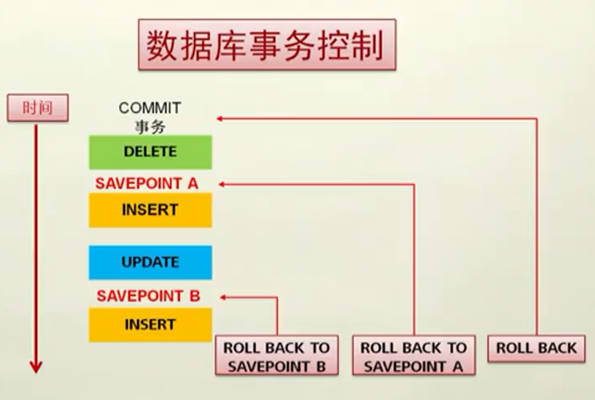

# Database Manual

## 表结构操作语句

创建表

```
CREATE TABLE [USER.] table_name
(
    { COLUMN 1 DATATYPE [COLUMN_CONSTRAIN] | TABLE_CONSTRAIN}
    [, {COLUMN 2 DATATYPE [COLUMN_CONSTRAIN] | TABLE_CONSTRAIN}]
);
```

---

常用数据类型

|数据类型|描述|例子|
|---|---|---|
|VARCHAR2(L)|可变长度字符串|VARCHAR2(20)|
|DATA|日期数据类型（日-月-年）|DD-MM-YY (HH-MI-SS)|
|NUMBER(p，s)|数字类型，P为整数位，S为小数位|NUMBER(10,2)|
|BOOLEAN|布尔值，仅有TRUE,FALSE,NULL|TRUE|

---

列约束和表约束
|列级约束|表级约束|
|---|---|
|NOT NULL（非空）| - |
|UNIQUE（唯一）|UNIQUE(唯一)|
|PRIMARY KEY（主键）|PRIMARY KEY（主键）|
|FOREIGN KEY（外键）|FOREIGN KEY（外键）|
|CHECK（条件检查）|CHECK（条件检查）|

```
CREATE TABLE EMP(
    ID VARCHAR2(6) PRIMARY KEY, 
    NAME VARCHAR2(20) NOT NULL,
    HIREDATE DATE DEFAULT SYSDATE NOT NULL,
    SALARY NUMBER(7,2)
    CONSTRAINT EMP_SAL_MIN CHECK (SALARY > 1000)    
);
```

---

增加列

> ALTER TABLE table_name ADD column_name datatype

```
ALTER TABLE EMP ADD ADDRESS VARCHAR2(40);

DESC EMP;
```

删除列

> ALTER TABLE table_name DROP COLUMN column_name

修改表名

> ALTER TABLE table_name RENAME TO new_table_name

```
ALTER TABLE EMP RENAME TO EMPS;

DESC EMPS;
```

修改列名

> ALTER TABLE table_name RENAME COLUMN column_name TO new_column_name

```
ALTER TABLE EMPS RENAME COLUMN NAME TO ENAME;

DESC EMPS;
```

删除表格
- CASCADE CONSTRAINTS 删除内容和定义（全部删除）
> DROP TABLE table_name CASCADE CONSTRAINTS;

```
DROP TABLE EMPS CASCADE CONSTRAINTS;
```

查看表结构

> DESCRIBE table_name
```
DESC EMPLOYEES
```
---

## 数据操作语句

增加新行

> INSERT INTO table[(column [,column ...])] VALUES (value [, value...]);

- 一次插入一行
- 每列都包含值
- 按表中列的默认顺序列出数值
- 可指定插入列名
- 日期和字符数值放入单引号

```
INSERT INTO EMP VALUES
(7902, 'ELINA', 'TRAINER', 9980, TO_DATE('2015/05/05', 'YYYY/MM/DD'), 3000, 100, 60);
```

```
## 隐式：从列列表中忽略列
INSERT INTO emp (empno, ename)
VALUES (7902,'ELINA');
```

```
## 显式： 在VALUES子句指定NULL关键字
INSERT INTO emp (emmpno, ename, job, mgr, hiredate, sal, comm, deptno)
VALUES (7902, 'ELINA', 'TRAINER', 9980, NULL, NULL, NULL, 50);
```

插入日期值
- TO_DATE 函数
- （例子）TO_DATE ('2015/05/05', 'YYYY/MM/DD')

---

修改行
- 若不使用WHERE子句，表中所有行都被修改（不推荐）

```
UPDATE table
SET column = value [, column = value, ...]
[WHERE condition];
```

```
UPDATE emp
SET deptno = 60, job = 'trainer'
WHERE ename = 'ELINA';
```

---

删除行
- 若不使用WHERE子句，表中所有行都被删除

```
DELETE [FROM] table_name
[WHERE CONDITION];
```
```
DELETE FROM emp WHERE ename = 'ELINA';
```

---

## 事务操作语句

事务开始于第一个DML SQL语句开始时， 结束于下列事件之一：
- 发出 COMMIT 或 ROLLBACK 语句
- 一个 DDL（数据定义语言） 或 DCL （数据控制语言） 语句执行（隐式提交）
- 用户退出iSQL Plus （默认提交）
- 系统崩溃（隐式提交）

---

事务控制命令
|事务命令|描述|
|---|---|
|Commit|提交事务|
|Rollback|回滚事务|
|Savepoint|事务标记点，可以回滚到不同阶段
|Rollback to \<savepoint\> | 回滚到标记点


COMMIT 之前
- 数据操纵操作首先影响数据库缓冲区,数据之前的状态可以恢复
- 当前用户可以查询表观察到数据操纵的结果
- 其他用户不能观察到当前数据操纵操作的结果
- 其他用户不能改变受影响行中的数据（被锁定）

COMMIT 之后
- 数据在数据库中被永久改变，数据以前状态永久丢失
- 所有用户都可以观察到事务结果
- 受影响的行的锁定被释放，其他用户可以操作该行
- 所有保存点被擦除

ROLLBACK后的数据状态
- 数据的改变被撤销
- 数据以前的状态被恢复
- 受影响行锁定被释放，其他用户可以操作该行

设置/回滚到保存点
```
SAVEPOINT a;
ROLLBACK TO SAVEPOINT a;
```


---

## SQL 语句简单优化

避免使用 ‘*’
- 解析过程会将 ‘*’ 一次转化成所有列名并通过查询数据字典完成
- 耗费更多时间

```
SELECT * FROM emp; (不推荐)
```

使用表的别名
```
SELECT e.ename, e.sal, d.deptno FROM emp e, dept d
WEHER d.deptno = e.deptno;
```

WHERE 子句中的连接顺序
- 从右往左运行
- 把快速缩小范围的语句放最后

```
SELECT * FROM emp e, dept d
WHERE d.deptno > 10 and e.deptno = 30; (推荐)
```

使用 ">=" 代替 ">"
```
## 高效（直接查询到值为4的结果）
SELECT * FROM EMP WHERE DEPTNO >= 4;
## 低效（首先会查询到值为3的结果）
SELECT * FROM EMP WHERE DEPTNO > 3;
```

用 TRUNCATE 代替 DELETE
- 如果没有commit操作，回滚段中会存放删除操作恢复的信息
- 回滚段不再存放任何可恢复的信息，因此资源调用少且执行时间短

尽量多使用COMMIT，节约以下资源
- 回滚段上用户恢复数据的信息
- 被程序语句获得的锁
- Redo log buffer中的空间
- Oracle 为管理上述资源中的内部花费

避免在索引列上使用函数

```
## 低效（不会使用sal的索引）
SELECT * FROM dept WHERE sal * 2 > 25000;
## 高效 (会使用sal的索引)
SELECT * FROM dept WHERE sal > 25000 / 2;
```


