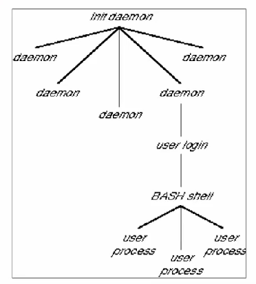

# Linux Advanced

## Vim 编辑器

一般模式下常用指令

|移动光标按键||
|---|---|
|0或Home键|移动光标到行首字符|
|$或End键|移动光标到行尾字符|
|gg|移动光标到文档第一行|
|G|移动光标到文档最后一行|
|nG|n为数字，移动光标到第n行|
|:set nu|显示行号|

|搜索和替换按键||
|---|---|
|/word|向光标之下搜索名为word的字符串|
|?word|向光标之上搜索名为word的字符串|
|n|重复前一个搜寻动作（/word1之后会继续向下搜索）|
|N|和n相反（/word1之后会向上搜索）|
|:n1,n2s/word1/word2/g|在n1和n2行间搜索word1并替换为word2|
|:1,$s/word1/word2/g|从第一行到最后一行搜索word1并替换为word2|
|:1,$s/word1/word2/gc|全文搜索word1并替换为word2，替换前要求用户确认|

|复制粘贴删除按键||
|---|---|
|x|删除光标字符后一个字符（=del）|
|X|向前删除一个字符（=backspace）|
|nx|n为数字，连续向后删除n个字符|
|dd|删除光标所在行一整行|
|ndd|删除光标所在行向下n行数据|
|yy|复制光标所在行|
|nyy|复制光标所在行向下n行数据|
|p|将已复制的数据从光标下一行开始粘贴|
|u|复原上一个动作（取消操作）|
|.|重复上一个动作|

---

|进入编辑模式按键||
|---|---|
|i|进入Insert模式，从目前光标所在处插入|
|a|进入Insert模式，从目前光标所在处下一个字符插入|
|o|进入Insert模式，从目前光标所在处下一行插入新行|
|r|进入Replace模式，取代光标所在字符一次|
|R|进入Replace模式，一直取代光标所在字符直到按Esc为止|
|ESC|退出编辑模式到一般模式|

|切换指令模式按键说明||
|---|---|
|:w|写入硬盘|
|:wq|保存并退出|
|:q!|强制退出且不保存|
|ZZ|若文件未被修改则不存储退出，若被修改则保存退出|
|:w filename|将编辑后的文件另存为filename|
|:r filename|将名为filename的文件内容读取到光标后面|

---

## Linux 文件系统管理

文件系统分类

    传统型文件系统
    - 不同时写入文件元数据，中断时不安全

    日志型文件系统
    - 首先操作记录文件，中断后可恢复

    非索引式文件系统
    - 只有block存在，需要一个block一个block读取，效率较低

    索引式文件系统
    - 文件属性和实际内容存在不同区块，通过属性数据可快速找到实际数据

目录树的读取
- 从文件系统顶层读取，获得inode号码。验证inode权限
- 根据inode读取block内的文件名数据
- 一层层往下读取正确的档案内容

---

Linux 的磁盘分区类型

- 主分区（primary） 3个
- 扩展分区（extended）1个
- 逻辑分区（logical）N个

Linux 分区命名方法

- `fdisk -l`  查看磁盘分区
- `Linux: /dev/hda2`
    - h: IDE 接口   s： SCSI 接口
    - d: 设备类型，硬盘
    - a: 第一块硬盘，对应第二块为b
    - 2: 分区编号

---

创建分区

> fdisk 设备名

- 输入参数 n 后，可以新建一个分区
- 使用 l 命令选择逻辑分区
- 选择分区开始的磁柱（默认磁柱）
- 决定分区大小/选择分区结束磁柱
- 使用 w 命令保存
- 重启激活

创建文件系统

> mkfs [-t 类型] [-b block大小] 设备名称

- `mkfs -t ext3 -b 1024 /dev/sda6`
- -t 指定文件系统类型，如ext3
- -b 指定block大小，单位bytes

手动挂载文件系统

> mount 设备名 挂载点

- `df -h` 查看挂载信息
- `mkdir testmount` 创建新目录
- `mount /dev/sda6 /root/testmount` 挂载文件系统到目录

手动卸载文件系统

> umount 设备名或挂载点

自动挂载文件系统

`/etc/fstab` 配置了开机自动挂载的文件系统
- 根目录必须最先挂载
- 挂载点必须已经存在
- 所有文件系统只能在同一时间挂载一次
- 文件内字段含义如下

|字段序号|字段意义|说明|
|---|---|---|
|1|文件系统|可以填写设备文件名，卷标或UUID|
|2|挂载点|已经存在的目录，绝对路径，特殊分区如swap不需要挂载点|
|3|文件系统类型|如ext3，ext4|
|4|文件系统参数|各种参数组合，不同参数用“，”隔开|
|5|是否采用dump备份|0 = 不备份，1 = 备份|
|6|是否开机自检|0 = 不采用fsck自检，1 = 采用fsck自检|

---

查看分区使用情况

> df 查看文件系统磁盘空间占用情况

- -h 以容易理解的格式列出文件系统大小
- -i 显示inode信息而非块使用量

> du 查看文件或目录磁盘使用空间

- -a 显示全部目录和子目录下档案所占磁盘空间
- -s 只显示大小的总和（summarize）
- -h 以容易理解的格式输出文件大小信息

查看打开的文件

> lsof 显示系统打开的文件

- 必须以root用户身份运行才有全部功能
- 直接运行时默认显示所有进程打开的所有文件
- -c 指定command
- -u 指定user

---

## Linux 网络管理

Linux 网络基础
- 设备  主机内的网卡
- 链路  设备到网络的连接
- 接口  驱动程序在设备上创建的接口
- 子网掩码  将IP地址划分为网络地址和主机地址两部分的掩码
- 广播地址  到达本网段上所有主机的地址

配置网络接口

> ifconfig 接口 [-option]

- 查看或设置网络接口的参数，如IP,掩码等

手动配置网络接口

- 配置文件在 `/etc/sysconfig/network-scripts/`
- 配置文件命名格式为 `ifcfg-[网卡名]`
- 以读取配置文件的方式启动网络接口 
    > ifconfig enp4s0 up

---

查看路由表

> route [-n]

- 查看本机路由表

配置路由

> route add [-net|-host] [netmask Nm] [gw Gw] [dev Dev]

- 示例 `route add -net 192.168.101.0 netmask 255.255.255.0 dev enp3s0`
- 示例 `route add -host 192.168.101.100 dev enp3s0`

新增路由

> route add default gw

- 暂时更改默认路由，重启后丢失
- 示例 `route add default gw 192.168.101.1`

删除路由

> route del [-net|-host] [netmask Nm] [gw Gw] [dev Dev]

---

侦测目的节点是否可达

> ping [-option] address

- -c 指定执行ping的次数
- -s 定义ISMP包的大小，默认64bytes

侦测到达目的节点路由

> traceroute [-option] <ipaddr or domain name>

- -n 不进行主机名解析，仅使用IP，速度较快
- -l 指定网络接口，如eth1，设定跟踪路由的源网卡

---

## Linux 进程和服务管理

进程相关概念

- 程序（program）   文件中保存的一系列可执行命令
- 进程（process）   加载到内存中的程序，由CPU运行
- 用户进程  用户通过终端加载的进程
- 守护进程  与终端无关的系统进程，可基于时间或事件启动

守护进程与用户进程的关系

---

查看进程

> ps

- 静态查看某一时间点进程信息
- 使用format参数按照一定格式组织信息
- 示例 `ps ax --format 'cputime %C, nice %n, name %c`

> ps aux

- 查看所有进程相关信息

> top

- 连续观察进程动态，按CPU使用率从高到低排列
- -d 修改刷新时间，默认3秒

> pstree

- 用ASCII字符显示树状结构

结束进程

> kill
- 结束进程，后跟进程号PID
- 进程可能相应该信号，也可能忽视
- 对于shell启动的后台任务，可用 `kill job_ID` 停止任务
- `-9` 参数迫使进程中止，结束后不能自我清理（不推荐）

> killall
- 结束同一进程组内的所有进程，后跟进程名称
- 示例 `killall httpd`

---

任务前后台调度

> sleep 100 &

- 直接将程序放入后台处理
- `jobs` 查看当前shell的后台任务

> Ctrl + Z

- 将正在运行的任务放入后台暂停

> fg %job ID

- 将任务放入前台执行

> bg %job ID

- 将任务放入后台执行
- 若不加 job ID， 表示对当前任务进行操作

周期计划任务

> crontab [-u user] [-e | -l | -r]

- -u 指定用户，仅限root用户使用
- -e 编辑crontab任务内容
- -l 查阅crontab任务内容
- -r 移除所有crontab任务内容，移除一项内容使用 -e

> Minute(0-59) Hour(0-23) Day(1-31) month(1-12) Week(0-7) Command
- 除 `Command` 必须指定外，其他字段皆为可选，但要用星号填补位置

定时计划任务

> at HH:MI

- 安排任务在未来执行

---

Systemd 程序任务
- 初始化文件系统，设置环境变量
- 挂载硬盘，/proc，/tmp，swap等
- 根据设置的运行级别，启动相应的守护进程
- 在系统运行期间监听整个文件系统

Systemd 服务管理

> systemctl start | stop | status [service]

- 通过systemctl管理服务

> journalctl -u A.service

- 通过journald查看A服务的日志
- 配置文件 `/etc/systemd/joournald.conf`

> journalctl --system --since=today

- 查看当天系统服务以及内核的日志

---

## Linux 系统监控

管理员监控项目
- 系统是否正常启动
- 系统负载
- 是否有非法用户登录

监控系统启动日志
- Kernel Ring Buffer
- `dmesg | less`
- `/var/log/dmsg`

---

监控硬件信息
- `/proc`   
    - 查看系统信息
- `hwinfo`  
    - 查看设备信息
    - --cpu 显示 CPU 信息
    - --disk 显示磁盘信息
- `fdisk`   
    - 查看硬盘信息
- `iostat`  
    - 查看 CPU 和 I/O 信息
    - -c 仅显示CPU统计信息，与-d选项互斥
    - -d 仅显示磁盘统计信息，与-c选项互斥
    - -k 以K为单位显示每秒磁盘请求数
- `lspci`   
    - 查看 PCI 信息
    - -v 显示PCI接口详细信息
    - -vv 显示更加详细的信息
    - -n 观察PCI的ID而非名称
- `free`    
    - 查看内存使用信息

---

监控系统和进程
- `ps` 
    - 显示当前进程状态（静态）
    - -elf 显示所有进程信息
    - -aux 显示所有包含其他使用者的进程
- `top` 
    - 即时显示进程动态
    - -p [pid] 查看指定进程的动态信息
    - -u [user] 查看指定用户启动的进程
- `uptime` 
    - 查看系统已开机时长和系统平均负载
- `uname` 
    - 查看系统版本信息
    - -a 显示所有信息
- `netstat` 
    - 显示IP,TCP,UDP协议相关统计数据，用于检查各端口网络连接情况
    - -a 显示所有连接端口
    - -n 以数字形式显示
    - -r 显示路由表
    - -t/u 显示TCP/UDP协议的连接

---

查看登录信息
- `who [option]` 
    - 查看当前登录用户
    - -H/-heading 显示各栏位标题信息列
    - -m 等同于who am i，显示自己的用户名，登陆终端，登录时间
- `w [option] [user]` 
    - 查看当前登录系统的用户和用户当前工作，比 `who` 更加详细
    - -u user 查看具体用户信息
- `finger [option] [user]` 
    - 查看用户详细信息
    - -s 短格式显示用户信息
    - -l 长格式显示用户信息
- `last [option]`
    - 查看曾经登录过系统的用户
    - -n num 设置列出名单的显示列数
    - -F 显示登录和登出的详细信息
- `lastlog [option] [user]`
    - 查看用户前一次登录的信息
    - -t days 查看距今n天内登录了系统的用户最近一次登录信息
    - -u 显示登录和登出的详细信息

