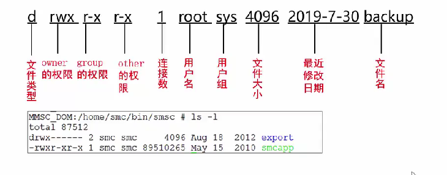

# Linux Basic

## Linux 系统概述

操作系统核心功能
- syscall接口
- 程序管理
- 内存管理
- 文件系统管理
- 驱动管理

Linux 结构

- 应用程序
- shell程序（Bash）
    - Bourne shell (sh)
    - C shell (csh) & korn shell (ksh)
    - Bash shell (/bin/bash)
- Linux内核（Kernel）
- 硬件

Linux 优势
- 多任务多用户
- 开发者交互界面
- 安全保护机制，稳定性好
- 用户界面，强大网络支持
- 移植性好

可用远程接入工具
- Xshell [SSH 客户端下载](http://www.xshellcn.com/xiazai.html)
- Xftp [SFTP 客户端下载](http://www.xshellcn.com/xftp.html)

Linux 目录结构
- / (根节点)
    - bin
    - dev
    - etc
    - home (工作目录)
    - usr
    - var (日志文件)
    - opt (第三方应用程序)
    - ...

---

## Linux 用户管理

Linux 的用户与群组

- 用户标识符 UID 与 GID
    - 用户ID保存路径 /etc/passwd
    - 组ID保存路径 /etc/group

- /etc/passwd 文件结构
    - 记录单个用户登录信息
        - 用户登录名
        - 用户口令（加密）
        - 指定用户UID
        - 组标识号GID
        - 描述信息（真实信息和个人细节）
        - 指定用户主目录绝对路径
        - 登陆时运行的shell程序名称，通常为全路径名
- /etc/shadow 文件结构
    - 记录用户密码信息
        - 账户名称
        - 用户密码（sha-512加密）
        - 最近密码更改日期
        - 密码再过几天可变更
        - 密码再过几天必须更改
        - 密码过期前几天提醒用户（默认一周）
        - 密码过期几天后账号会被取消
        - 从1970/1/1算起多少天后，账号失效
- /etc/group 文件结构
    - 记录GID与组名对应关系及群组中包含用户
        - 组名
        - 组密码
        - 群组GID
        - 包含的用户

---

群组管理

- 新增群组
```
groupadd [-option] [群组名]
    -g 指定组 ID
```

- 修改群组
```
groupmod [-g n] [群组名]
    -g 修改组ID
    -n 修改组名
```

- 删除群组
```
groupdel [群组名]
```

---

用户管理

- 新增用户
```
useradd [-option] [用户名]
    -d 设置用户家目录
    -m 若家目录不存在则自动创建
    -u 设置UID（默认自动设置UID）
    -g 设置GID或组名（默认建立和用户名相同的组或根据配置文件自动设置）
    -G 设置用户加入的其他群组（非初始群组，/etc/group第四个字段）
    -s 指定用户的shell，如/bin/csh
```

- 设置用户密码
```
passwd [用户名]
```

- 修改用户属性
```
usermod [-option] [用户名]
    -d 修改用户/home目录
    -e 修改用户密码失效日期
    -g 修改初始群组
```

- 删除用户
```
userdel [-option] [用户名]
    -r 连同用户home目录一起删除
```

- 切换用户
```
su [-] [用户名]
    [-] 不保留原用户环境变量（推荐）
```

- 用户查询相关命令
```
who: 查询当前登录系统所有用户
id：查询当前用户GID和UID
finger：查询用户属性信息
```

---

## Linux 文件和目录管理

显示当前工作目录

`pwd`

更改工作目录

`cd (无参数时用 $HOME 作为参数)`

`. 当前目录`

`.. 上一级目录`

查看文件或目录
```
ls [-option] [目录或文件]
    -l 以长格式列出文件
    -a 以短格式列出文件（包含隐藏文件）
```

---

Linux文件和目录权限

- 文件权限
    - r（read）可读取实际内容
    - w（write） 可编辑文件内容（不含删除）
    - x（execute）可被系统执行
- 目录权限
    - r（read）可读取目录结构列表
    - w（write）可修改目录结构列表
        - 可建立新文件和子目录
        - 可删除内文件和子目录
        - 可重命名和移动内文件和子目录
    - x（execute）可进入该目录

文件属性和权限示例



---

修改属主
- 该命令改变文件ID
- 仅文件属主或root用户可使用
```
chown [-R] 文件主 文件
    -R 递归改变子目录下所有文件属主
```

修改所属群组
- 该命令改变文件ID
- 仅文件属主或root用户可使用
```
chgrp [-R] 所属群组 文件
```

修改权限
```
chmod [-options] mode files
chmod [ugoa] {+|-|=} [rwx] files

chmod -R 777 temp 全权限修改
```

---

## 文件和目录基本操作

新建文件和目录

```
touch 文件名
```
- 会改变已有文件的时间戳属性

```
mkdir [-m 模式] [-p] 目录名
    -m 按指定存取模式建立目录
    -p 建立目录时建立所有不存在的父目录
```
- 目录的存取模式由umask决定
- 要求对其父目录有写权限

---

复制文件和目录
```
cp [option] 源文件或目录 目的文件或目录
    -i 复制文件和目录（递归）所有特性
    -p 复制修改时间和修改权限
    -r 递归复制
```
- 本地主机复制文件或目录
- 要求对父目录具有写权限

```
scp [option] 源文件或目录 目的文件或目录
    -r 递归复制
```
- 远程主机复制文件或目录
- 要求对父目录具有写权限

---

移动文件和目录
```
mv [-fiu] 源文件或目录 目的路径
    -f 强制移动
    -i 询问后覆盖
    -u 更新
```
- 要求对父目录具有写权限

---

删除文件和目录
```
rmdir [-p] 目录名
    -p 删除目录和其父目录
```
- 要求对父目录具有写权限

```
rm [-fir] 文件或目录（常用）
    -f 强制删除
    -i 询问后删除
    -r 递归删除
```
- 要求对父目录具有写权限

---

查找文件或目录路径（速度较慢）
```
find path [-option] [查找条件]
    -name 根据文件名精确查找

find / -name test.txt
find ./ -name "*test*" （"*" 通配字符）
```

从数据库中查找（更快搜索）
```
locate [-d DBPATH] [--version] [查找条件]
    - 从数据库中搜索，速度较快，每天更新一次
    - -d 使用 DBPATH代替默认数据库 (/var/lib/mlocate/mlocate.db) 
    - 使用 updatedb 命令更新数据库

whereis [-option] 文件或目录名称
    - 只用于从数据库中查找程序名，一星期更新一次
    - -b 只找二进制文件
    - -m 只找在说明文件manual路径下的文件
    - -s 只找source源文件

which 可执行文件名称
    - 用于通过PATH环境变量到该路径查找可执行文件
    - 例子 which passwd / which php
```

---

查看文件内容

`cat` - 直接查阅，不能翻页

`more` - 翻页查看文件

`less` - 翻页查看，操作更弹性

`head` - 查看前几行，默认10行

`tail` - 查看后几行，默认10行

---

查找文件内容
```
grep [-cin] '目标字符串' filename
    -c 计算找到'搜寻字符串'的行数
    -i 忽略大小写
    -n 顺便输出行号
    -l 根据文件内容查找文件，只显示包含该内容的文件名
    -r 根据文件内容递归查找文件，并打印对应内容

## 将/etc/passwd文件中包含root的行取出
grep root /etc/passwd
[/cat /etc/passwd | grep root]

## 在当前目录及子目录搜索带‘energywise’行的文件，只显示文件名
grep -rl 'energywise' *
```

---

管道命令
```
cat /etc/passwd | grep oracle
```

---

输出重定向

`>` - 覆盖导入

`>>` - 从文件末尾导入

`<` - 输入重定向

- 标准文件 stdin，stdout，stderr 对应文件描述符 0，1，2

```
## 将ls -l命令重定向到ls.out中
ls -l > ls.out

## 将命令正确输出/错误输出/所有输出重定向到文件中
find / -name filename [>/2>/&>] find.txt
```


